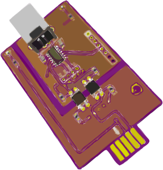

[CyberCard](https://medo64.com/cybercard/)
==========================================

This USB device will show up on your system as a serial device and allow for a
fully isolated serial communication with CyberPower UPS devices that have support
for RMCARD202/RMCARD205 interface.

It was inspired with [Jeff Mayes Serial Interface](https://www.jmayes.com/cyberpower-backup-serial-protocol-and-interface/)
and wouldn't be possible without his extensive research.

To connect to the device, access serial device using 2400,8,N,1 (2,400 baud rate,
8 data bits, no parity, 1 stop bit) parameters. Protocol is described [here](PROTOCOL.md).

Tested devices:
* OR500LCDRM1U
* OR700LCDRM1U

---

*You can check my blog and other projects at [www.medo64.com](https://www.medo64.com/electronics/).*
